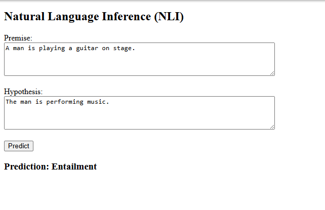
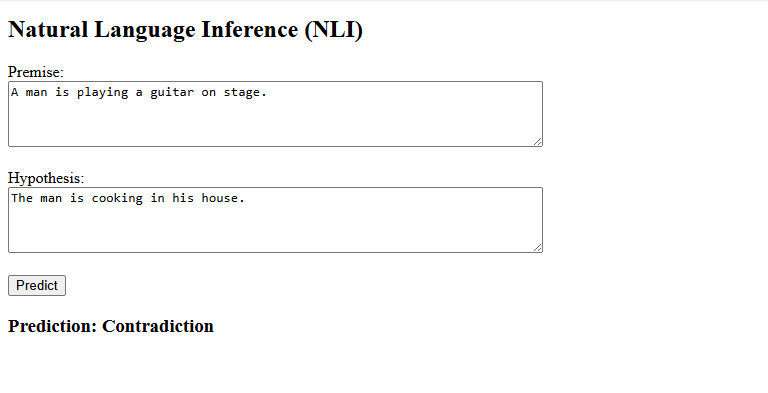

# NLP Assignment A4 -- BERT from Scratch + SBERT + NLI Web App

## Overview

This project implements:

1.  Task 1 -- Training BERT from scratch using Masked Language Modeling
    (MLM) and Next Sentence Prediction (NSP).
2.  Task 2 -- Sentence-BERT style fine-tuning on the SNLI dataset using
    SoftmaxLoss.
3.  Task 3 -- Evaluation and analysis on the SNLI test set.
4.  Task 4 -- A Flask web application for Natural Language Inference
    (NLI).

------------------------------------------------------------------------

## Project Structure

A4_AIT/ │ ├── app/ │ ├── app.py │ ├── model.py │ └── templates/ │ └──
index.html │ ├── A4_main.ipynb ├── task1_bert_scratch.pth ├──
task2_sbert_snli_softmaxloss.pth ├── requirements.txt ├── .gitignore └──
README.md

------------------------------------------------------------------------

## Task 1 -- BERT from Scratch

-   Dataset: WikiText-103 (subset of 100k lines)
-   Objective: MLM + NSP
-   Vocabulary size: 30,000 (word-level)
-   Architecture (CPU-friendly):
    -   Layers: 2
    -   Hidden size: 128
    -   Heads: 2
    -   Max sequence length: 64
-   Trained for 300 steps on CPU

Model saved as: task1_bert_scratch.pth

------------------------------------------------------------------------

## Task 2 -- SBERT with SoftmaxLoss (SNLI)

-   Dataset: SNLI
-   Training subset: 20,000 samples (efficient runtime)
-   Validation/Test subset: 2,000 samples each
-   Sentence embedding: Mean pooling
-   Classifier: concat(u, v, \|u−v\|) → Linear → 3 classes

Model saved as: task2_sbert_snli_softmaxloss.pth

------------------------------------------------------------------------

## Task 3 -- Evaluation

Test Accuracy: \~41%

### Classification Report (Test Set)

| Class           | Precision | Recall | F1-Score | Support |
|----------------|----------:|-------:|---------:|--------:|
| Entailment     | 0.45      | 0.43   | 0.44     | 690     |
| Neutral        | 0.39      | 0.61   | 0.47     | 660     |
| Contradiction  | 0.40      | 0.18   | 0.25     | 650     |
| **Accuracy**   |           |        | **0.41** | 2000    |
| **Macro Avg**  | 0.41      | 0.41   | 0.39     | 2000    |
| **Weighted Avg** | 0.41    | 0.41   | 0.39     | 2000    |

The model performs best on the Neutral class. Contradiction recall is
lower, likely due to: - Small architecture (2-layer BERT) - Word-level
tokenizer - Limited training steps - CPU-based constraints

Despite these limitations, the full training → fine-tuning → evaluation
→ inference pipeline works correctly.

------------------------------------------------------------------------

## Task 4 -- Web Application

Run the web app:

cd app python app.py

Open in browser: http://127.0.0.1:5000

### Website UI

------------------------------------------------------------------------

## Installation

Create virtual environment:

python -m venv .venv source .venv/bin/activate (Mac/Linux)
.venv`\Scripts`{=tex}`\activate     `{=tex}(Windows)

Install dependencies:

pip install -r requirements.txt

------------------------------------------------------------------------

## Notes

-   BERT is trained entirely from scratch.
-   Model architecture is reconstructed explicitly when loading weights
    (state_dict best practice).
-   Designed to run on CPU within assignment time constraints.
