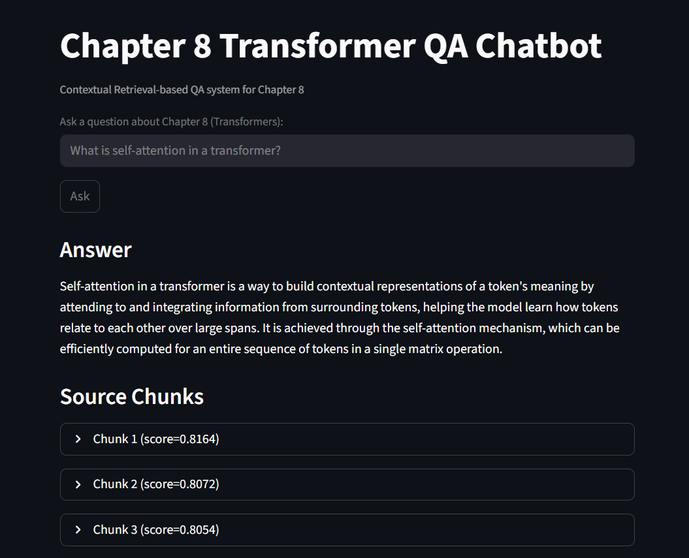

# Chapter 8 Transformer QA Chatbot (RAG Assignment)

This project implements a Retrieval-Augmented Generation (RAG) system
for answering questions about **Chapter 8: Transformers**.

## 🚀 Features

-   Naive RAG vs Contextual Retrieval
-   Groq LLM integration
-   ROUGE evaluation
-   Streamlit chatbot UI

## 📊 Evaluation

  Method                 ROUGE-1   ROUGE-2   ROUGE-L
  ---------------------- --------- --------- ---------
  Naive RAG              0.0000    0.0000    0.0000
  Contextual Retrieval   0.3908    0.1548    0.3059

## 🌐 Web Demo



## ⚙️ Run App

``` bash
streamlit run app/app.py
```

## 👤 Author

Thiri
