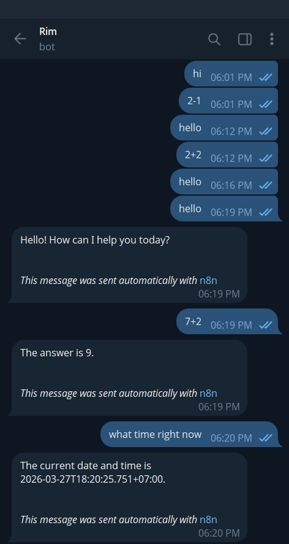

# NLP Assignment: AI Agent with n8n, MCP, and Telegram Integration

## Overview

This project demonstrates an AI-powered workflow using n8n,
integrating: - AI Agent (LLM-based) - MCP (Model Context Protocol)
Server & Client - Google Calendar API - Telegram Bot Interface

## System Architecture

User (Telegram) → n8n Workflow → AI Agent → MCP Tools / Google Calendar

## Components

### n8n

-   Self-hosted with Docker
-   Exposed via ngrok

### MCP Server

Tools: - Calculator - Date & Time - Code Tool

### MCP Client

### Telegram Bot

## Features

### Calculator

Input: 2+2 → Output: 4

### Date & Time

Input: what time right now

### Calendar Event Creation

Example: Create a calendar event with title "Literature Review", start
"2026-08-06T10:00:00", end "2026-08-06T12:00:00"

 

## Challenges

-   Duplicate executions fixed by removing duplicate models
-   Tool schema mismatch fixed by aligning input fields
-   Model deprecation fixed by switching models

## Conclusion

This project shows practical AI workflow integration using n8n and
external tools.

## Author

Thiri Shin Thant
